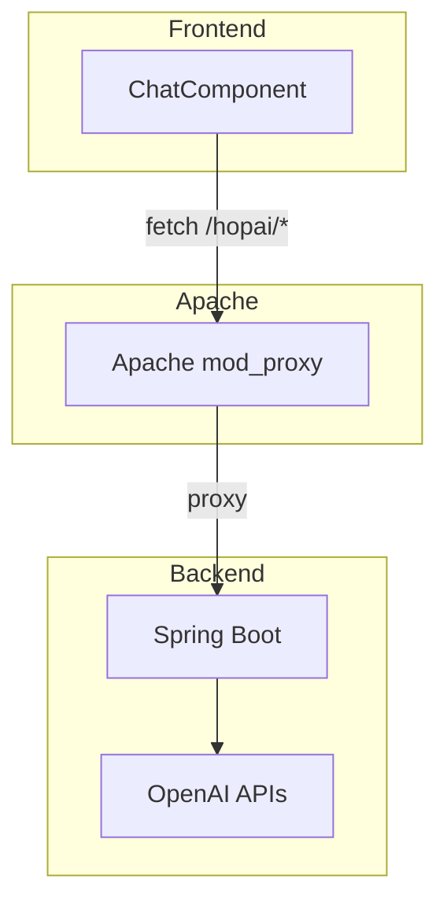

# HOP‑AI

> **Chat, génération d'images & recettes IA** – Spring Boot 3 × React19


---

## ✨ Aperçu du projet

HOP‑AI est une application full‑stack qui démontre comment **intégrer l'écosystème Spring AI** (OpenAI, génération d'images, etc.) avec un **frontend React** hébergé sous le même domaine. Le tout tourne sur un VPS **AlmaLinux 9** équipé de **cPanel/WHM**.

Fonctionnalités principales :

| Module              | Description                                           | Endpoint (HTTP)                | UI                            |
| ------------------- | ----------------------------------------------------- | ------------------------------ | ----------------------------- |
| **Chat AI**         | Répond en langage naturel via OpenAI Chat Completions | `/ask-ai?prompt=`              | `/hopai` (champ *Chat*)       |
| **Options AI**      | Variation de la réponse (top N choices)               | `/ask-ai-options?prompt=`      | —                             |
| **Image Generator** | Crée jusqu'à *n* images depuis un prompt              | `/generate-image?prompt=`      | `/hopai` (section *Images*)   |
| **Recipe Creator**  | Compose une recette à partir d'ingrédients            | `/recipe-creator?ingredients=` | `/hopai` (section *Recettes*) |
| **Health**          | Vérifie l'état du backend (Spring Boot Actuator)      | `/api/health`                  | —                             |

---

## 🖼️ Capture d'écran (front React)


---

## 🏗️ Architecture



---

## ⚙️ Pile technologique

- **Backend** : Java 17 · Spring Boot 3.4 · Spring AI 1.x · Maven
- **Frontend** : React 19 · Vite (via `react‑scripts`) · JavaScript
- **Infrastructure** : AlmaLinux 9 · systemd · Apache 2.4 (cPanel EA‑4) · DigitalOcean droplet

---

## 🚀 Mise en route locale

> Pré‑requis : `git`, JDK 17, `mvn`, Node ≥ 18, `npm` 10.

```bash
git clone https://github.com/<votre‑org>/HOP-AI.git
cd HOP-AI
```

### 1. Backend

```bash
mvn clean spring-boot:run
# ➜ service sur http://localhost:8080
```

### 2. Frontend

```bash
cd hopai-demo-react
npm ci
npm run start   # http://localhost:3000 (proxy CRA → 8080)
```

---

## 🔑 Variables d'environnement

| Clé              | Exemple                       | Description                                 |
| ---------------- | ----------------------------- | ------------------------------------------- |
| `OPENAI_API_KEY` | `sk-************************` | Clé secrète OpenAI (env backend)            |
| `VITE_API_BASE`  | `/hopai`                      | Base des appels API côté React (build prod) |

Créez le fichier `src/main/resources/application.properties` ou `/etc/hopai/hopai.env` :

```properties
OPENAI_API_KEY=sk-************************
```

---

## 📡 Endpoints REST

```text
GET /ask-ai?prompt=Bonjour
GET /ask-ai-options?prompt=Bonjour
GET /generate-image?prompt=Château
GET /recipe-creator?ingredients=tomate,fromage
GET /api/health              # via Spring Boot Actuator
```

Toutes les routes sont **CORS‑friendly** et, en production, disponibles sous `/hopai/*` grâce au reverse‑proxy Apache.

---

## 🖥️ Déploiement (AlmaLinux 9 + cPanel)

1. **Build**
   ```bash
   mvn clean package -DskipTests
   cd hopai-demo-react && npm ci && npm run build
   ```
2. **Service systemd**
   ```ini
   [Unit]
   Description=HopAI
   After=network.target
   [Service]
   User=cpanel
   ExecStart=/usr/bin/java -jar /opt/hopai/target/HOP-AI-0.0.1-SNAPSHOT.jar
   EnvironmentFile=/etc/hopai/hopai.env
   Restart=on-failure
   [Install]
   WantedBy=multi-user.target
   ```
3. **Apache** – `public_html/.htaccess`
   ```apache
   RewriteEngine On
   RewriteRule ^hopai/(ask-ai.*|generate-image.*|recipe-creator.*|api/.*)$ http://127.0.0.1:8080/$1 [P,L]
   RewriteCond %{REQUEST_FILENAME} !-f
   RewriteCond %{REQUEST_FILENAME} !-d
   RewriteRule ^hopai/?(.*)$ /hopai/index.html [L]
   ```
4. **SSL** : AutoSSL WHM couvre déjà `najibhossam.works/*`.

---

## 🤝 Contribuer

1. Forkez le dépôt
2. Créez votre branche de feature : `git checkout -b feat/ma-feature`
3. Commitez : `git commit -m "feat: nouvelle fonctionnalité"`
4. Push : `git push origin feat/ma-feature`
5. Ouvrez une Pull Request

Code style : Prettier + ESLint (config CRA).

---

## 🙌 Remerciements

- [Spring AI](https://github.com/spring-projects/spring-ai)
- [DigitalOcean](https://www.digitalocean.com/)
- [OpenAI](https://openai.com)

---
